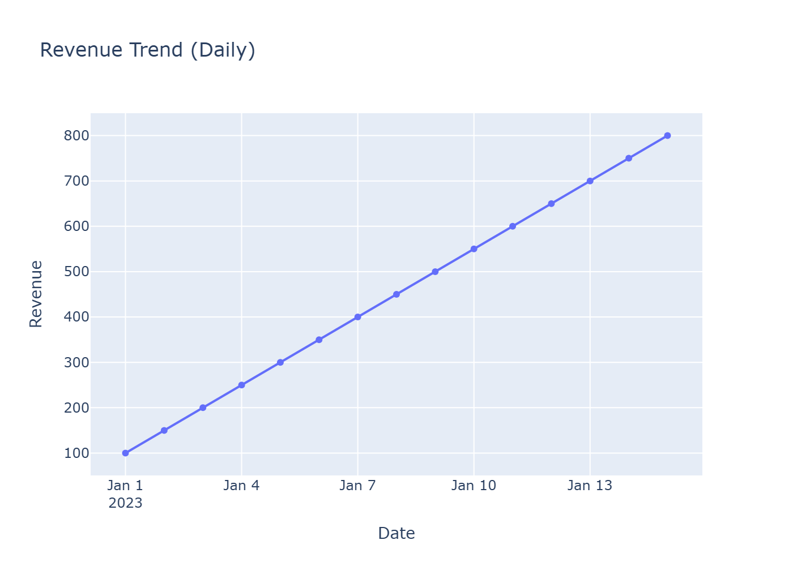
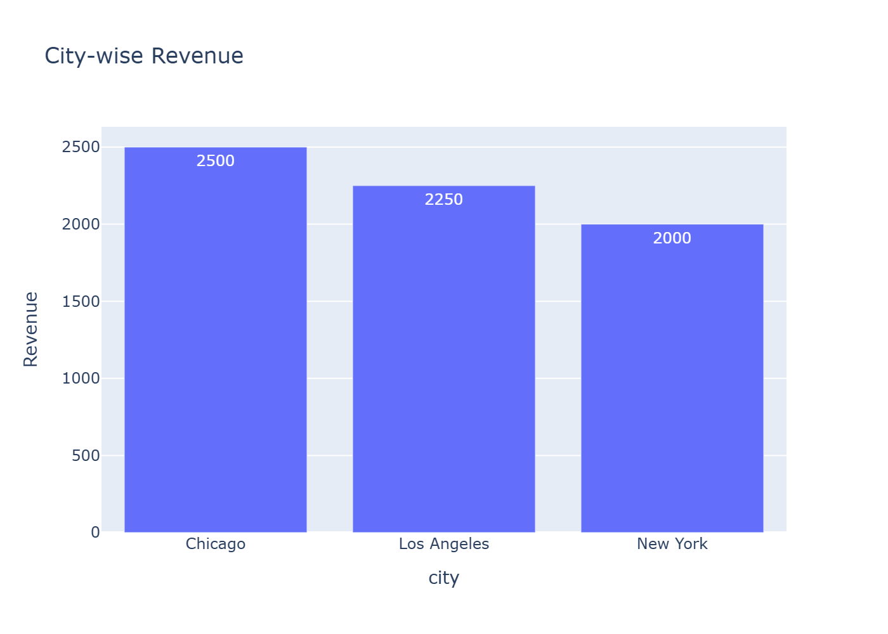
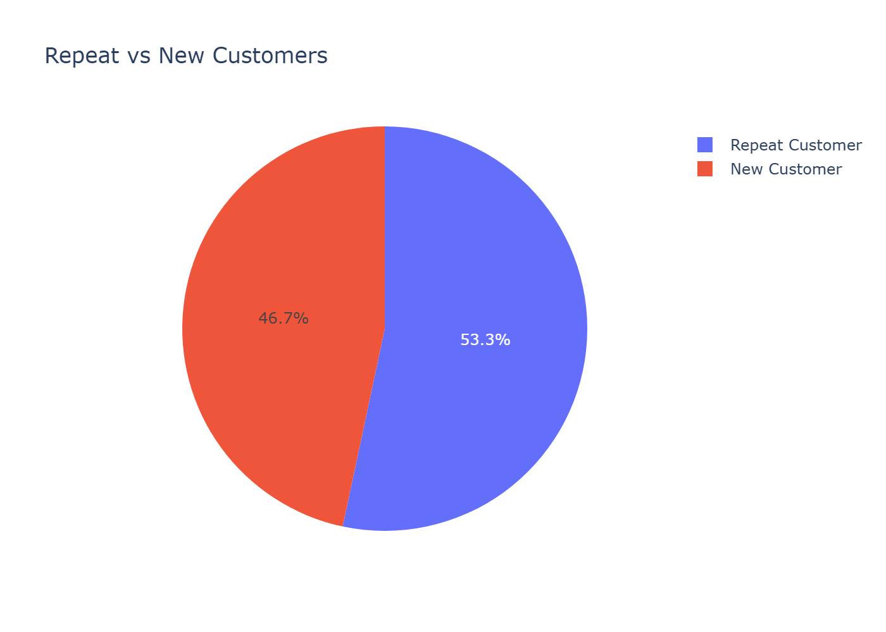
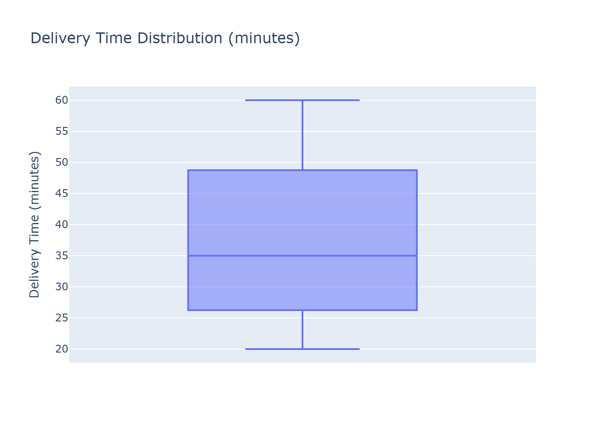

# Business Intelligence Dashboard

## Business Problem Statement
This dashboard provides executive and operational stakeholders with an at-a-glance and drillable view of core business performance for a food delivery / e-commerce business. It enables monitoring of revenue, order volume, customer retention, and delivery performance so leaders can quickly identify trends, operational issues, and opportunities.

## KPIs Defined
- **Total Revenue**: Total income from completed orders — primary topline metric for business health.
- **Total Orders**: Total number of orders placed — measures demand and customer activity.
- **Average Order Value (AOV)**: Revenue divided by orders — indicates basket size and pricing effects.
- **Repeat Customer Rate**: Percentage of customers who returned — proxy for retention and customer satisfaction.
- **Order Cancellation Rate**: Share of orders cancelled — highlights friction in ordering or fulfillment.

## Dashboard Features
- Executive KPI cards with real-time aggregation
- Revenue and Order Volume trend charts (daily)
- City-level revenue breakdown (sorted descending)
- Repeat vs New customer composition chart
- Delivery time distribution (box plot) to surface SLA breaches and outliers
- Interactive filters: Date range, City selector, Order status — all visuals update together

## How to Run (Local)
1. Create and activate a Python virtual environment (recommended):

```powershell
python -m venv .venv
& .venv\Scripts\Activate.ps1
```

2. Install dependencies:

```powershell
pip install -r requirements.txt
```

3. Start the dashboard:

```powershell
python app.py
```

4. Open the dashboard in your browser at: http://127.0.0.1:8050/

Notes:
- Use `requirements.txt` in this folder to reproduce the environment. The app is built with `pandas`, `plotly`, and `dash`.
- In production, run the app via a WSGI server (Gunicorn/Waitress) and set `debug=False`.

## Business Use Cases
- **Executives**: Review topline revenue and order trends to evaluate growth targets and campaign impact.
- **Operations Managers**: Monitor delivery time distribution and cancellation rate to identify process improvements and SLA breaches.
- **Analysts**: Filter by city and order status to diagnose regional performance, returns, or cancellations.

## Project Structure
```
business-intelligence-dashboard/
├── data/
│   └── sample_data.csv
├── app.py
├── requirements.txt
├── README.md
└── assets/ (optional styling)
```

## Dashboard Screenshots

### Revenue Trend Analysis


### Orders Volume Trend


### City-wise Revenue Performance


### Repeat vs New Customers


### Delivery Time Distribution (Operational Efficiency)


## Next Steps / Enhancements
- Add pagination or table export for raw orders
- Add user authentication for role-based views
- Persist queries or add scheduled reporting exports

If you want, I can add these enhancements and commit them to a branch.
